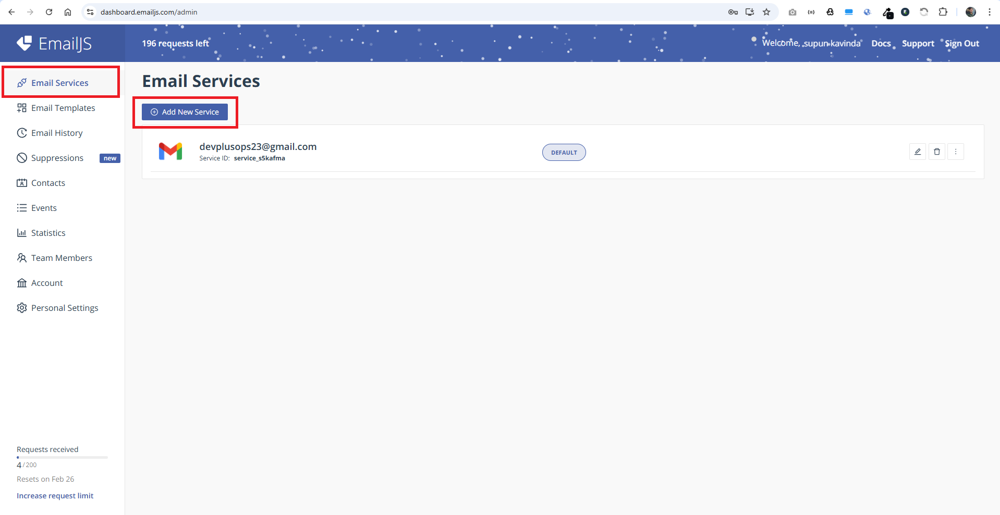

# Developer Portfolio Template 🚀

 logoColor=white)     

## What is this?

This portfolio template is designed to showcase your past projects, career history, skill sets, and more.

## Quick Setup

1. Ensure you have [Node.js](https://nodejs.org/) installed. Check your installation by running:

    ```bash
    node -v
    ```

2. In the project directory, install dependencies:

    ```bash
    npm install
    ```

3. Start the development server:

    ```bash
    npm start
    ```

4. Open [http://localhost:3000](http://localhost:3000) to view the app in the browser.

## How to Setup EmailJS

### How to creare a new EmailJS account:
1. Go to [EmailJS](https://emailjs.com/) and create a new account and login to your account
2. Click "Add a new service" button in "Email Services" section in left sidebar

3. Then you will see the popup window and click the "Connect Account" button. Also Copy the service ID.
. 
After this it will show a new window and make sure to click all the check boxes

Note: After connecting your account, if you are getting kind of "can not connect to the email" error, disconnect and reconnect your account.
4. Then go to the "Email Templates" section in side bar and Click "create new template" button, and add below templete to the it

```text
Hello Brian,

You got a new message from {{from_name}} : User Email {{from_email}}

{{message}}

Best wishes,
EmailJS team
```

5. Then go to the "setting tab" and get the "Template Id"

6. Then Go to the "Account" section in side bar and copy the "Public key"

7. Copy the service ID, template ID, and public key
8. Paste the service ID, template ID, and public key into the configuration file `src/config/email.ts`